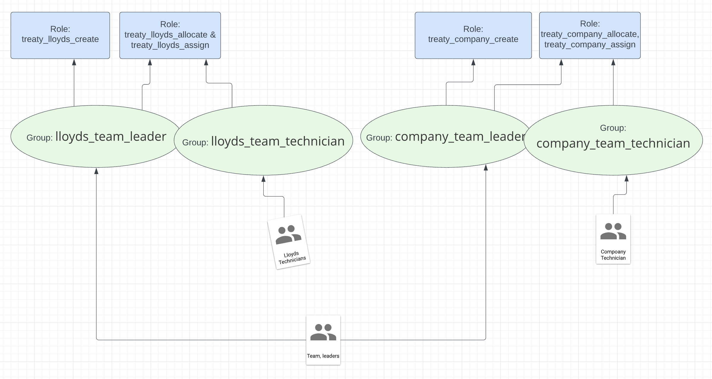

Business Application Initial Content
====================================

Basic example of KIE Server SpringBoot with KeyCloak integration (SSO).

Prerequisites
--------------

 - Download and install RHSSO.
 - Import realm [rhpam-treaty-dxc-realm_export](realm/rhpam-treaty-dxc-realm_export.json). Client named `springboot-user-app` created and it's AccessType is public.
 - Create following users.
 
  
 
| User Id           | Group		          	                    | Roles
| ----------------: | ----------------------------------------- | -----------------------------------------------------------------------------------------------------------------------------------------------
| teamlead_lc  		| lloyds_team_leader & company_team_leader  | treaty_lloyds_create , treaty_lloyds_allocate , treaty_lloyds_assign , treaty_company_create , treaty_company_allocate & treaty_company_assign
| teamlead_l        | lloyds_team_leader                        | treaty_lloyds_create , treaty_lloyds_allocate & treaty_lloyds_assign
| teamlead_c        | company_team_leader                       | treaty_company_create , treaty_company_allocate & treaty_company_assign
| technician_l1     | lloyds_team_technician                    | treaty_lloyds_allocate & treaty_lloyds_assign
| technician_l2     | lloyds_team_technician                    | treaty_lloyds_allocate & treaty_lloyds_assign
| technician_c1     | company_team_technician                   | treaty_company_allocate & treaty_company_assign
| technician_c2     | company_team_technician                   | treaty_company_allocate & treaty_company_assign
 
 
 

KIE Server with KeyCloak
------------------------

KIE Server SpringBoot  application that uses KeyCloak and Spring Security for securing access to KIE Server resources.

This sample requires KeyCloak to be installed and configured with following defaults:
- keycloak.auth-server-url=http://localhost:8080/auth
- keycloak.realm=rhpam-treaty-dxc
- keycloak.resource=springboot-user-app

Step 1: Checkout and build (mvn clean install) the below project.
https://github.com/rmuppane/work-flow

Step 2: Checkout and build (mvn clean install).
https://github.com/rmuppane/sb-kie-server-sso-service

When we compare with the basic SpringBoot KIE application (https://github.com/rmuppane/sb-kie-server-service) following changes were added to achieve KeyCloak integration.

pom.xml

	Dependencies

	
		<dependency>
				<groupId>org.keycloak</groupId>
				<artifactId>keycloak-spring-boot-starter</artifactId>
				<exclusions>
					<exclusion>
						<artifactId>commons-logging</artifactId>
						<groupId>commons-logging</groupId>
					</exclusion>
				</exclusions>
			</dependency>
			<dependency>
				<groupId>org.keycloak</groupId>
				<artifactId>keycloak-common</artifactId>
				<version>${version.keycloak}</version>
			</dependency>
	
			<dependency>
				<groupId>org.keycloak</groupId>
				<artifactId>keycloak-admin-client</artifactId>
				<version>${version.keycloak}</version>
				<scope>test</scope>
				<exclusions>
					<exclusion>
						<groupId>commons-logging</groupId>
						<artifactId>commons-logging</artifactId>
					</exclusion>
					<exclusion>
						<groupId>jakarta.ws.rs</groupId>
						<artifactId>jakarta.ws.rs-api</artifactId>
					</exclusion>
					<exclusion>
						<groupId>org.jboss.resteasy</groupId>
						<artifactId>resteasy-multipart-provider</artifactId>
					</exclusion>
					<exclusion>
						<groupId>org.jboss.resteasy</groupId>
						<artifactId>resteasy-jaxb-provider</artifactId>
					</exclusion>
				</exclusions>
			</dependency>
			<dependency>
				<groupId>org.springframework.boot</groupId>
				<artifactId>spring-boot-starter-security</artifactId>
			</dependency>
	
			<dependency>
				<groupId>org.springframework</groupId>
				<artifactId>spring-test</artifactId>
				<scope>test</scope>
			</dependency>
			<dependency>
				<groupId>org.kie.server</groupId>
				<artifactId>kie-server-client</artifactId>
				<version>${version.org.kie}</version>
				<scope>test</scope>
				<exclusions>
					<exclusion>
						<groupId>jakarta.ws.rs</groupId>
						<artifactId>jakarta.ws.rs-api</artifactId>
					</exclusion>
					<exclusion>
						<groupId>org.slf4j</groupId>
						<artifactId>jcl-over-slf4j</artifactId>
					</exclusion>
				</exclusions>
			</dependency>
	
	
	Dependency Management

			<dependencyManagement>
				<dependencies>
					<dependency>
						<groupId>org.keycloak.bom</groupId>
						<artifactId>keycloak-adapter-bom</artifactId>
						<version>${version.keycloak}</version>
						<type>pom</type>
						<scope>import</scope>
					</dependency>
				</dependencies>
			</dependencyManagement>
	
	

All KeyCloak configuration properties are present in [application.properties](src/main/resources/application.properties).
	
	
	keycloak.auth-server-url=http://localhost:8080/auth
	keycloak.realm=rhpam-treaty-dxc
	keycloak.resource=springboot-user-app
	keycloak.public-client=true
	keycloak.principal-attribute=preferred_username
	keycloak.enable-basic-auth=true
	kie.restricted-role=President
	

Java classes

- [KeycloakIdentityProvider.java](src/main/java/com/rh/service/KeycloakIdentityProvider.java)
- [KeycloakVariableGuardProcessEventListener.java](src/main/java/com/rh/service/KeycloakVariableGuardProcessEventListener.java)
- [DefaultWebSecurityConfig.java](src/main/java/com/rh/service/DefaultWebSecurityConfig.java)

Step 3: To run the Application

java -Dorg.kie.server.json.format.date=true -Dorg.kie.server.bypass.auth.user=true -jar ./target/sb-kie-server-sso-service-1.0-SNAPSHOT.jar

or

mvn clean spring-boot:run -Drun.jvmArguments="-Dorg.kie.server.json.format.date=true -Dorg.kie.server.bypass.auth.user=true"

Testing
-------

Test the application by using the java client or postman scripts 

- Java Client:  https://github.com/rmuppane/kie-server-sso-user-client.git

- Postman scripts avilable at [SSOIntegration.postman_collection.json](src/postmanscripts/SSOIntegration.postman_collection.json)
